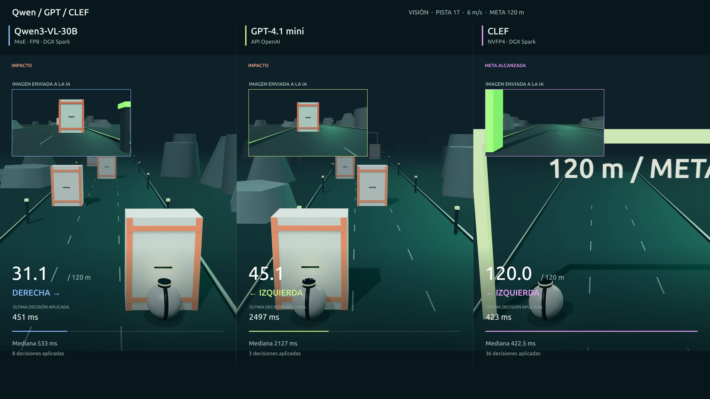

# Comparación de modelos en un entorno 3D

Qwen, GPT y CLEF controlan el mismo robot con **dos decisiones: izquierda o derecha**. El robot avanza por tres carriles hacia una meta a 120 metros. El mundo sigue avanzando mientras el modelo responde.

[](docs/comparison.mp4)

Pulsa la portada para abrir el MP4 comparativo incluido en el repositorio (4K, 27 segundos).

Construido con **Three.js y Node.js**. El mundo se genera por código; no utiliza Blender ni assets de pago. Puede funcionar con modelos locales, remotos o APIs.

## Arranque rápido

Requisitos: Node.js 22+, pnpm y navegador con WebGL. FFmpeg es opcional, solo para exportar MP4.

```bash
pnpm install --frozen-lockfile
pnpm start
```

Abre **http://127.0.0.1:4180**. Para probar la pista sin modelos, selecciona **Reglas** o **Tú**. La aplicación no descarga pesos ni inicia servidores de inferencia por sí sola.

## Conecta tus modelos

Abre ⚙ y guarda las URLs, nombres de modelos y claves que correspondan. También puedes copiar `.connections.example.json` a `.connections.json` y editarlo. La configuración real permanece local y está excluida de Git. Para variables de entorno, copia `.env.example` a `.env` y ejecuta `pnpm run start:env`.

| Controlador  | Entrada              | Conexión                                               |
| ------------ | -------------------- | ------------------------------------------------------ |
| Qwen         | Imagen o texto/LiDAR | Servidor compatible con Chat Completions y JSON Schema |
| GPT-4.1 mini | Imagen o texto/LiDAR | API de OpenAI                                          |
| CLEF         | Imagen o texto/LiDAR | Adaptador SystemOne incluido, o un servidor compatible |
| Jev          | **Solo texto/LiDAR** | API de TypeSafe; fuera del vídeo de visión             |
| Otro LLM     | Según el modelo      | API compatible con Chat Completions                    |
| Reglas / Tú  | LiDAR / teclado      | Sin modelo ni credenciales                             |

La [guía de conexiones](docs/CONNECTIONS.md) explica cómo crear las claves de Jev y OpenAI, conectar Qwen y levantar el adaptador opcional de CLEF. Cada usuario configura su infraestructura: no se incluyen conexiones privadas de otro equipo.

## Ejecutar la misma prueba

1. Selecciona modelo, **Cámara**, **pista 17** y **6 m/s**.
2. Pulsa **Preparar modelo**. Hace una petición con el robot inmóvil; puede tener coste en APIs externas.
3. Inicia la carrera. La física no espera al modelo.
4. Repite con el siguiente modelo conservando pista, velocidad, modo y retraso artificial.
5. **↓ Datos** exporta las lecturas/imágenes, decisiones, tiempos, posiciones y errores. También se guardan en `runs/`.

Cada orden mueve **un carril**. Repetir izquierda en el extremo izquierdo, o derecha en el extremo derecho, mantiene ese carril. Entre respuestas se conserva el destino actual. No hay salto, freno, tercera acción ni asistencia que corrija al modelo.

## Qué ve el modelo

**Cámara:** una imagen frontal JPEG de 640×360, velocidad y latencia anterior. No recibe distancias, mapa, semilla, posición ni interfaz.

**LiDAR:** tres distancias longitudinales, una por carril, en un plano 2D. No hay información de altura. Se añaden velocidad, carril objetivo, transición y latencia anterior. Es un sensor idealizado por corredores, no un simulador físico completo de LiDAR.

El fallo observado en algunas pruebas con LiDAR no prueba que los modelos no puedan usar ese sensor: también intervienen la representación del estado, las instrucciones y el control. Visión y LiDAR son condiciones distintas.

## Vídeo y resultados

Abre **http://127.0.0.1:4180/compare.html** para reproducir las tres carreras incluidas. **Exportar vídeo 4K** vuelve a renderizar sus posiciones reales a 3840×2160 y 30 fps, preservando tiempos y decisiones; requiere FFmpeg disponible en PATH o `FFMPEG_PATH`.

Para móviles y LinkedIn, abre **http://127.0.0.1:4180/mobile.html**: versión vertical 1080×1920, con Qwen, GPT y CLEF uno después del otro. También permite exportar un MP4 a 30 fps. Ambas versiones usan exactamente los mismos registros e incluyen la imagen original enviada a la IA en cada petición.

Las carreras se ejecutaron **por separado**, con calentamiento previo, y después se sincronizaron para el vídeo. La exportación no hace nuevas peticiones a modelos. No es una grabación de tres inferencias simultáneas ni una animación de decisiones inventadas.

Los [datos y la metodología](docs/RESULTS.md) identifican versiones, condiciones, resultados y límites. Se incluye el primer ensayo completo de cada modelo después de prepararlo para esta comparación. **Un ensayo por modelo no constituye un ranking general.**

## Medidas y límites

La latencia se mide desde la captura del estado hasta procesar la respuesta en el navegador: incluye render/captura, red, inferencia y cualquier retraso añadido. La mediana mostrada usa decisiones aplicadas antes de terminar. Las tardías y los errores se conservan por separado. Hay una petición pendiente como máximo y 100 ms entre recibirla e iniciar la siguiente.

Qwen y GPT devuelven `{"action":"LEFT"}` o `{"action":"RIGHT"}` mediante JSON Schema estricto; CLEF devuelve una elección nativa. Un formato válido no garantiza una buena decisión. La física avanza en pasos de hasta 1/120 s; cambiar de carril tarda 0,30 s. Si se oculta la pestaña, la carrera termina para evitar tiempos alterados por la limitación de pestañas en segundo plano.

Esta es una demostración reproducible de control y latencia, no una validación de seguridad para robots físicos.

## Desarrollo

```bash
pnpm test
pnpm run check:public
```

- `public/physics.mjs`: pista, colisiones y sensor.
- `public/app.mjs`: juego y registro de carreras.
- `server.mjs`: conectores y configuración local.
- `public/compare.mjs`: reproducción de la comparación.
- `video.mjs`: exportación MP4 sin alterar los tiempos registrados.
- `adapters/clef/`: adaptador opcional para el modelo público.

La configuración privada, los pesos, las claves, la caché, grabaciones y carreras de desarrollo están excluidos por `.gitignore`. Solo los tres registros seleccionados para la comparación están incluidos expresamente. La aplicación escucha en localhost; no es un servicio multiusuario listo para Internet.

Licencia MIT para la aplicación. Three.js y los modelos conservan sus propias licencias.
